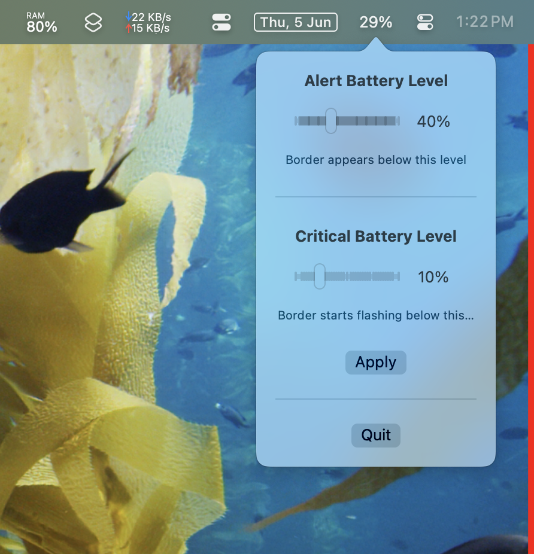

# AwesomeBattery

AwesomeBattery is a macOS menu bar application that provides visual battery alerts through screen borders. It comes out of my personal use case as I always forget to charge my macbook. This app will almost always force you to charge your laptop when it gets below the desired threshold values.

## Features

- Menu bar battery percentage indicator
- Visual border alerts when battery is low
- Configurable alert and critical battery thresholds
- Automatic border width adjustment based on screen size
- Multi-screen support
- "Charge Now" warning text for extremely low battery

## Menu Bar Interface

The menu bar shows your current battery percentage and provides quick access to settings. When charging, it displays a charging indicator alongside the percentage.

### Settings Available in Menu
- **Alert Threshold**: Set the battery percentage (default: 20%) at which the red border appears. This is your first warning to consider charging your MacBook.
- **Critical Threshold**: Set the battery percentage (default: 10%) at which the border starts flashing. Must be lower than the alert threshold and cannot be set below 2%.
- **Enable/Disable**: Quickly toggle the app on or off without quitting it.
- **Quit**: Exit the application completely.

## How It Works

The app monitors your MacBook's battery level and provides visual feedback through colored borders around your screen(s):

### Normal State (Above 20% by default)

- No border shown
- Battery percentage visible in menu bar

### Alert State (11%-20% by default)

- Shows a red border around all screens
- Border width gradually increases as battery level drops
- Maximum border width is 1.6% of the smallest screen dimension

### Critical State (10% and below by default)
- Border starts flashing to grab attention (animation not shown in screenshots)
- Uses maximum border width (1.6% of smallest screen dimension)
- Shows "CHARGE NOW" warning text when battery drops below half of critical threshold (5%)

### Charging State
- All alerts are cleared
- Border disappears
- Battery percentage shows charging indicator in menu bar

## Settings

You can configure:
- Alert battery threshold (default: 20%)
- Critical battery threshold (default: 10%, cannot be set lower than 2% or higher than alert threshold)
- Enable/disable the app from the menu bar

## Installation

1. Download the latest AwesomeBattery_Installer.dmg
2. Open the DMG file
3. Drag AwesomeBattery to your Applications folder
4. Launch AwesomeBattery from Applications
5. (Optional) Add to Login Items to start automatically

## System Requirements

- macOS 11.0 or later
- Apple Silicon or Intel Mac

## Privacy & Permissions

The app requires:
- Permission to run in the background
- Screen recording permission (to draw borders around screens)

## Support ❤️

[paypal.me/manishasinghhyd](https://paypal.me/manishasinghhyd)

## License

Copyright © 2025 Manisha. All rights reserved.
